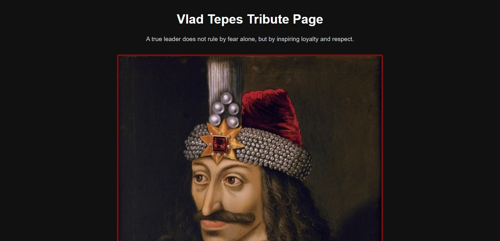

# Vlad Tepes Tribute Page

## 📖 Overview

This project is part of my FreeCodeCamp Responsive Web Design certification.
The objective was to build a tribute page using only HTML and CSS.

I chose to honor Vlad Țepeș (Vlad the Impaler), the 15th-century ruler of Wallachia. While feared for his harsh punishments, he is also remembered in Romania as a strong leader who defended his land.

The page focuses on clean structure, semantic HTML, responsive design, and simple styling that adapts across devices.

## ✨ Features

- Responsive design that works on desktop, tablet, and mobile.

- Semantic HTML5 structure for accessibility.

- Styled headings, sections, and image with caption.

- Historical highlights about Vlad Țepeș (birth, reign, and death).

- A quote section with emphasis styling.

- External resource link for further reading.

- Footer credit section with developer link.

## 🛠️ Built With

HTML – page structure and semantic elements

CSS – styling, layout, responsive media queries

## 🚀 How to Use

<a href="https://midnight-developer-ts.github.io/tribute-page/">Click here to view the project</a>

Or clone/download this repository and open index.html in your browser.

## 📂 Project Structure

tribute-page/

│── index.html       # main webpage  

│── css/  

│   └── styles.css   # styling  

│── images/  

│   └── tribute-preview.jpeg  # preview/share image  

│── README.md        # project details  

## 📌 Learning Goals

- Practice semantic HTML elements (headings, sections, lists, figure, figcaption).

- Apply CSS styling for readability and emphasis.

- Use media queries to ensure responsiveness on tablets and phones.

## 📸 Preview

⚠️ Note: The main portrait of Vlad Țepeș used in this project is sourced from Wikimedia Commons
, which is in the public domain.